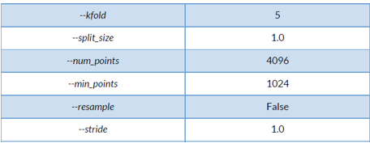
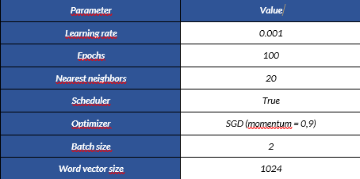
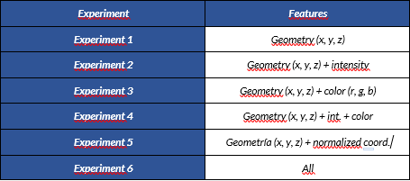
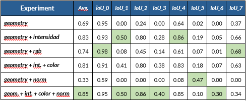
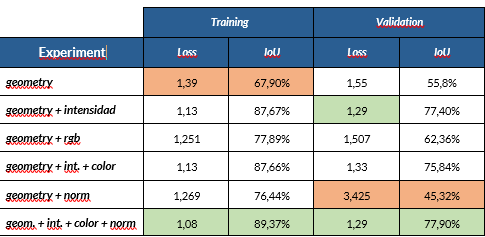

# LiDAR attribute based point cloud labeling using CNNs with 3D

The goal of this work is to study how semantic segmentation techniques can be adapted to use LiDAR point clouds in their original format as input. Until now, almost all the methods that have been proposed to apply deep learning models on point clouds keep their focus on generic point clouds, making use only of geometric or color information. In this work we replace the most common option, convolutional models, with Edgeconv, a convolutional operator that uses nearest neighbors to extract local features. We show the results of an experimentation that reveals the influence of additional LiDAR information channels on the performance of the neural network. Unlike other related works, this one is based in the study of semantic segmentation applied to outdoor environments.

## Key features

 - Point cloud semantic segmentation techniques can be adapted to use LiDAR in their original form.
 - Point cloud datasets are regularized in order to be adapted to the neural network.
 - The proposed neural network uses Edgeconv to extract local features.
 - LiDAR intensity channel remarkably improves the performance of the neural network.

## Architecture
Insert image later

## Dataset
We are using [Semantic3D](https://www.semantic3d.net/) dataset to test our neural architecture.

## Files included
We have used [PyTorch](https://pytorch.org/) to develop the neural network. The source files included in the repository are: 

 - models/*.py: Implementation of the neural network architecture and some utility functions
 - preprocessing/preprocessor.py: Classes to prepare a training dataset and some stuff related to retrieval and storage of data.
 - preprocessing/spatial.py: Some utility functions and other stuff to work with three-dimensional point clouds.
 - utils/*.py: Functions to load data during training, download Semantic3D dataset from the webpage, calculate precision metrics, log executions, measure time of execution, load and storage of neural models, and also some utility functions to view 3D point clouds using O3D Library. 
 - classify_clouds.py: Script to classify an input dataset using some pretrained model and other parameters as input.
 - prepare_data.py: Script to prepare a training dataset using a set of labeled point clouds as input.
 - train_network.py: Train a neural network using a previous processed training dataset as input, and output generated result and files to a specified via parameter directory. 
 - resume_training.py: In the case you are running your experiments in a cluster, and your experiment is someway interrupted, you are able to resume your training indicating the desired epoch and the neural network serialized object to resume the training from.

## Execution
As a previous step to those all following, create a virtual environment (use Anaconda or Miniconda for the sake of compatibility) and install libraries described in environment.yml, requirements_pip.txt.

### Preparing data
First of all, you must prepare your training data from a set of labelled point clouds. Two types of dataset are supported, LiDAR (.las files) and Semantic3D. Each dataset is located in a separated folder (see ./data for more information). 
<br>
There are some parameters you must indicate to prepare your dataset, and those are described in prepare_data.py. 
<br>
To prepare a dataset, run the following command according to your desired arguments:

```
python prepare_data.py --download "False" --dataset "Semantic3D" --redirect_log prepare_4m_2s.log --subsample "True" --kfold "5" --split_size "4.0" --num_points 4096 --min_points 1024 --output_dir "train_4m_2s" --stride 2.0 --resample "False"
```

The previous command will produce a set of hdf5 files that will serve as input for the training step. Those files are stored on the same directory as the main point clouds, and training script will look in that directory at the moment of execution.

### Training
To train some model, run train_network.py with your own parameters. Use the following command to run the script: 

```
python train_network.py --exp_name "all_features" --dataset "Semantic3D" --learning_rate 0.001 --scheduler "True" --epochs 200 --nearest_neighbors 20 --momentum 0.9 --output_models "checkpoints" --optimizer "SGD" --bias "False" --dim9 "True" --emb_dims 1024 --workers 8 --batch_size 42 --features "x y z i r g b xn yn zn" --num_features 10 --num_points 4096
```

## Experiments
We have obtained the following results according to the following configuration of the system:
### Parameters
We use Semantic3D dataset to train our network. The parameters that have been used to generate the training dataset are: <br>


To train our network from the previous dataset, we use: <br>


We propose 6 experiments with different configuration of features, in order to prove that some channels of information available on LiDAR are able to improve the segmentation results with regard to the exclusive usage of geometric information.<br>

### Results
Finally, we obtain the following results, proving that the addition of the intensity channel improves the segmentation precission with regard to the only use of geometry to perform the segmentation.
<br/>
First of all, segmentation results per class (classes are described in our paper):<br>

<br/>
And finally, we compare training results to validation results, in both loss and precision: <br>

